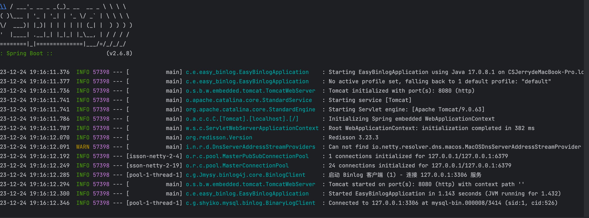
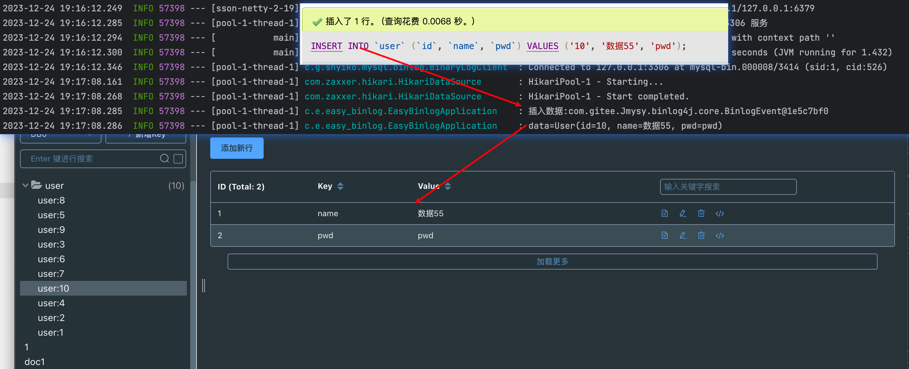
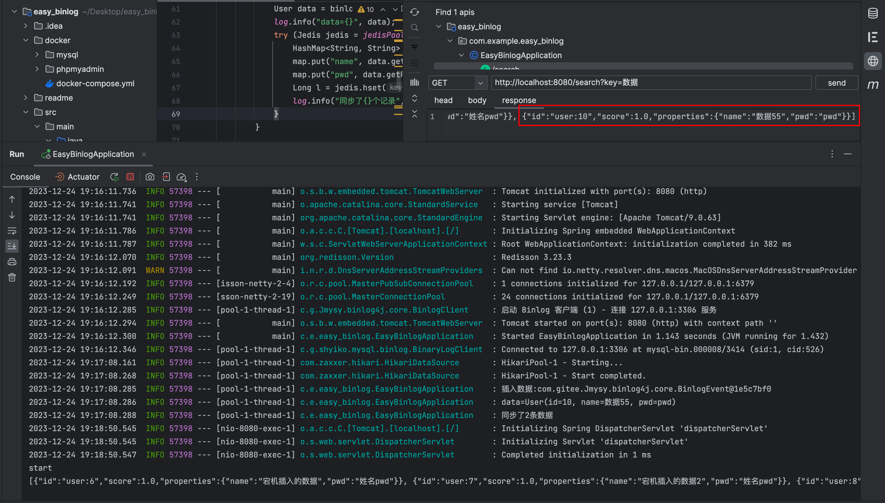
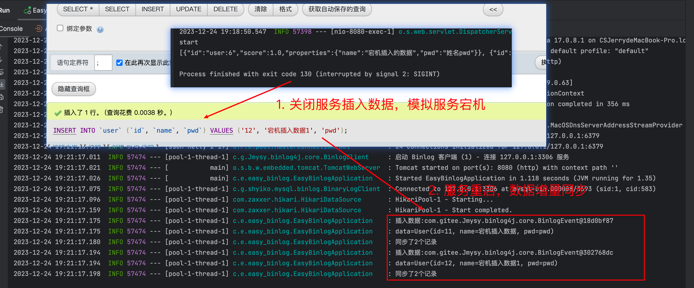

# binlog增量同步redis,全文搜索实战

## 环境准备
```shell
cd ./docker
docker-compose up --build
```
> 注意，如果登录mysql时，提示无法远程登录，需要谷歌解决一下，把`host`切换成`%`, 然后刷新一下权限

建立`mysql` 表

```sql
create database test;
use test;
create table `user`(
  id bigint unsigned primary key auto_increment,
  name varchar(25),
  pwd varchar(255)
);
```

创建`redis search `索引

```shell
FT.CREATE user PREFIX 1 user: LANGUAGE chinese LANGUAGE_FIELD chinese SCHEMA name TEXT pwd TEXT
```

启动项目



* 在`mysql` 中插入数据

数据成功同步`redis` 



数据搜索成功



* 数据宕机后增量同步



